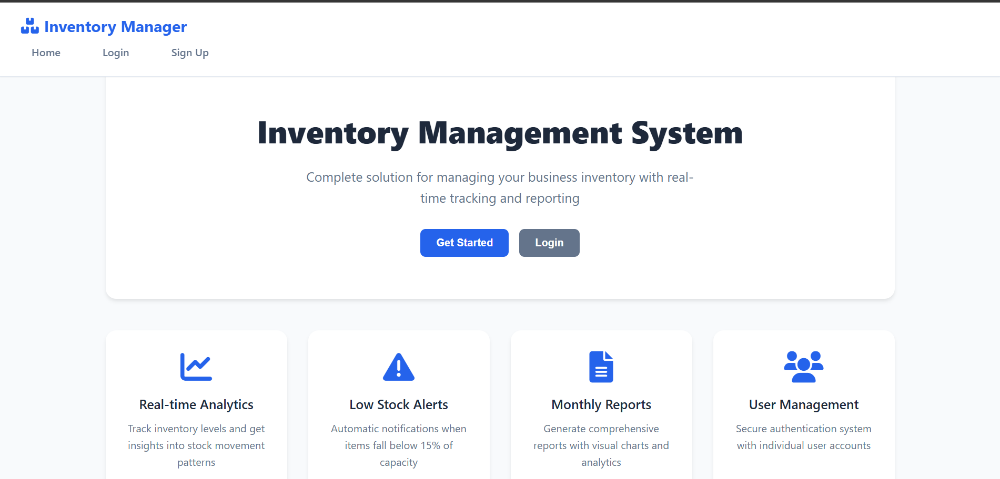
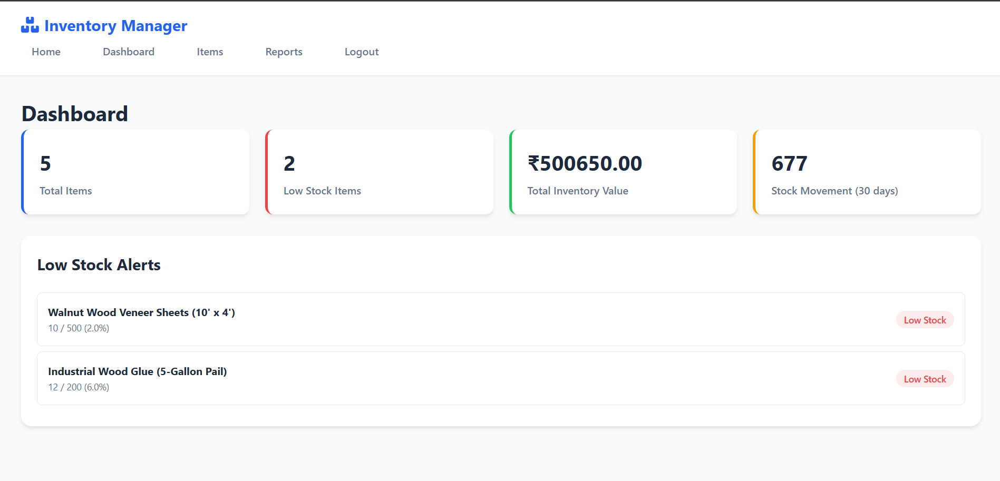
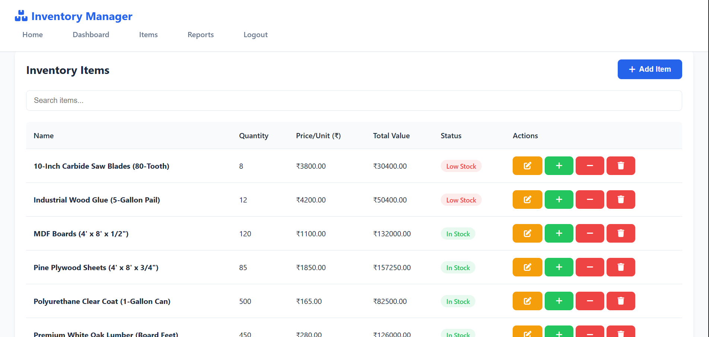

# Inventory Management System

A complete web-based inventory management system built with Node.js, Express, MongoDB, and modern frontend technologies.

🔗 **Live Demo:** [View Live Web Application](https://inventorymanagement-d9zm.onrender.com/)

## Screenshots

### Landing Page


### Dashboard Overview


### Items Management


## Features

### Core Features
- **User Authentication**: Secure signup/login system with JWT tokens
- **Item Management**: Full CRUD operations for inventory items
- **Stock Tracking**: Real-time tracking of stock levels with transaction logging
- **Low Stock Alerts**: Automatic alerts when items fall below 15% of capacity
- **Monthly Reports**: Visual charts and comprehensive reporting system
- **Responsive Design**: Mobile-friendly interface inspired by Zoho Inventory

### Technical Features
- **Backend**: Node.js with Express.js
- **Database**: MongoDB with Mongoose ODM
- **Frontend**: Vanilla HTML5, CSS3, and JavaScript
- **Authentication**: JWT-based secure authentication
- **Validation**: Comprehensive input validation and error handling
- **Security**: Rate limiting, password hashing, and secure headers

## Prerequisites

- Node.js (v14 or higher)
- MongoDB (v4.4 or higher)
- npm or yarn

## Installation

1. **Clone the repository**
   ```bash
   git clone <repository-url>
   cd InventoryManagement
   ```

2. **Install dependencies**
   ```bash
   npm install
   ```

3. **Set up environment variables**
   Create a `.env` file in the root directory:
   ```env
   PORT=3000
   MONGODB_URI=mongodb://localhost:27017/inventory_management
   JWT_SECRET=your_jwt_secret_key_here
   JWT_EXPIRES_IN=7d
   ```

4. **Start MongoDB**
   Make sure MongoDB is running on your system.

5. **Run the application**
   ```bash
   # Development mode
   npm run dev

   # Production mode
   npm start
   ```

6. **Access the application**
   Open your browser and go to `http://localhost:3000`

## Usage

### Getting Started
1. Create an account by clicking "Get Started" on the landing page
2. Login with your credentials
3. Navigate to the dashboard to see overview statistics
4. Add items to your inventory from the Items page
5. Generate reports from the Reports page

### Managing Items
- **Add Items**: Click "Add Item" and fill in the item details
- **Edit Items**: Click the edit button on any item row
- **Stock In/Out**: Use the + and - buttons to adjust stock levels
- **Delete Items**: Remove items permanently (deletes all transaction history)

### Understanding Low Stock Alerts
- Items are flagged as "Low Stock" when quantity ≤ 15% of max capacity
- Low stock items appear prominently on the dashboard
- Visual indicators (red badges) show low stock status

### Generating Reports
- Select month and year to generate monthly reports
- View stock movement trends with interactive charts
- Export capabilities can be added for PDF/Excel reports

## Database Schema

### Users Collection
```javascript
{
  _id: ObjectId,
  username: String,
  email: String,
  password: String (hashed),
  created_at: Date,
  last_login: Date
}
```

### Items Collection
```javascript
{
  _id: ObjectId,
  name: String,
  quantity: Number,
  price_per_unit: Number,
  max_capacity: Number,
  user_id: ObjectId (reference to User),
  created_at: Date,
  updated_at: Date
}
```

### Transactions Collection
```javascript
{
  _id: ObjectId,
  item_id: ObjectId (reference to Item),
  transaction_type: String ('IN' or 'OUT'),
  quantity_changed: Number,
  user_id: ObjectId (reference to User),
  date: Date,
  notes: String (optional)
}
```

## API Endpoints

### Authentication
- `POST /api/auth/signup` - Create new user account
- `POST /api/auth/login` - User login

### Items
- `GET /api/items` - Get all items for authenticated user
- `POST /api/items` - Create new item
- `PUT /api/items/:id` - Update existing item
- `DELETE /api/items/:id` - Delete item

### Transactions
- `POST /api/transactions` - Create stock transaction
- `GET /api/transactions` - Get transactions with optional date range

### Dashboard & Reports
- `GET /api/dashboard` - Get dashboard statistics
- `GET /api/reports/monthly` - Get monthly reports with chart data

## Security Features

- **Password Hashing**: bcryptjs for secure password storage
- **JWT Authentication**: Stateless authentication with configurable expiration
- **Rate Limiting**: Prevents brute force attacks
- **Input Validation**: Comprehensive validation using express-validator
- **CORS Protection**: Configurable CORS settings
- **Secure Headers**: Security-focused HTTP headers

## Development

### Project Structure
```
InventoryManagement/
├── models/              # Database schemas
├── public/              # Frontend files
│   ├── css/            # Stylesheets
│   └── js/             # JavaScript files
├── package.json        # Dependencies and scripts
├── server.js          # Main application file
├── .env              # Environment variables
└── README.md         # This file
```

### Adding New Features
1. Backend: Add new routes in `server.js`
2. Database: Update schemas in `models/` directory
3. Frontend: Update HTML templates and JavaScript files
4. Styling: Modify CSS in `public/css/style.css`

### Testing
- Manually test all CRUD operations
- Verify authentication flows
- Test low stock alert functionality
- Validate report generation
- Check responsive design on different screen sizes

## Deployment

### Local Deployment
1. Ensure MongoDB is running
2. Set up environment variables
3. Run `npm start`

### Production Deployment
1. Set up MongoDB Atlas or similar cloud database
2. Configure production environment variables
3. Use a process manager like PM2
4. Set up reverse proxy (nginx/Apache)
5. Configure SSL certificates

## Contributing

1. Fork the repository
2. Create a feature branch
3. Make your changes
4. Test thoroughly
5. Submit a pull request

## License

This project is licensed under the MIT License - see the LICENSE file for details.

## Acknowledgments

- Zoho Inventory for UI/UX inspiration
- Modern web development best practices

## Support

For any issues or questions, please create an issue in the repository or contact me at vaibhavvoff@gmail.com
